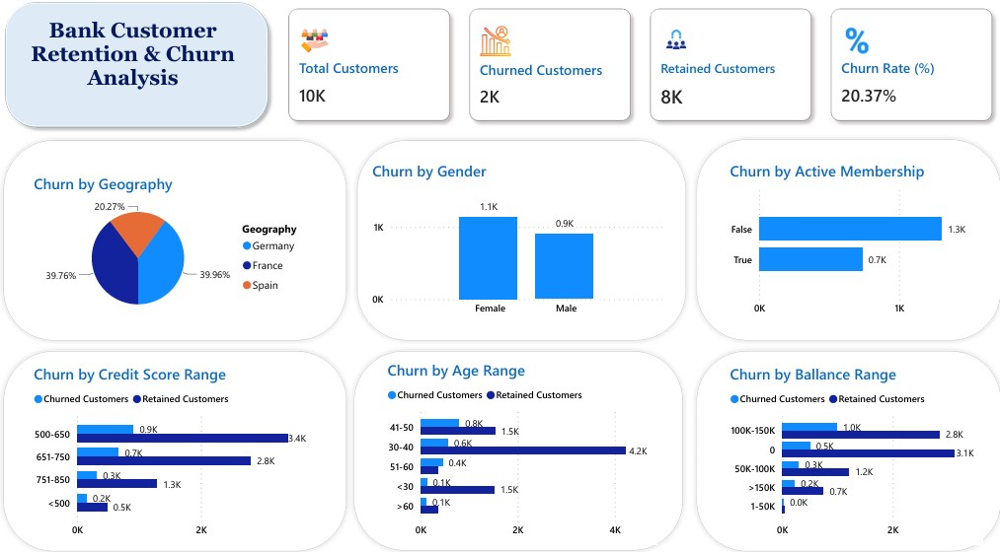

# Bank Customer Churn Analysis: SQL & Power BI Dashboard

🚀 Project Overview

This project analyzes bank customer churn to identify the key factors driving customer attrition from a dataset of 10,000 customers. The workflow involved using SQL for data extraction and initial exploratory analysis, followed by developing an interactive Power BI Dashboard for executive insights and strategic decision-making.

The primary goal was to pinpoint demographic and financial segments with the highest propensity to churn, allowing the bank to design targeted retention campaigns.

📊 Dashboard Visualization: Bank Churn

The final dashboard provides a comprehensive, visual summary of the churn metrics across various dimensions (Geography, Age, Credit Score, and more).

Key Metrics:

Total Customers: 10,000

Churned Customers: 2,037

Overall Churn Rate: 20.37%

🔑 Key Findings & Insights

The analysis successfully identified several segments showing significantly high churn counts. These findings were derived from the SQL queries and visualized in the dashboard:

Category | High Churn Segment | Churned Customers (Count) | Strategic Insight
---|---|---|---
Active Membership | Inactive (False) | 1,302 | Inactive members are the highest churn risk; focus efforts on re-engaging this group.
Geography | Germany | 814 | Churn is most concentrated in Germany, requiring market-specific interventions.
Gender | Female | 1,139 | Female customers show a higher churn count than male customers.
Age Range | 41-50 | 788 | Middle-aged customers are the most volatile group.
Balance Range | $100K - $150K | 987 | Customers with mid-to-high balances are leaving in large numbers, suggesting dissatisfaction with high-value account services.
Credit Score | 500 - 650 | 907 | Customers with lower-to-average credit scores exhibit higher churn rates.

🛠️ Technologies Used

SQL (T-SQL/PostgreSQL/MySQL): Used for data cleaning, aggregation, and deep-dive analysis (queries are located in Bank Churn SQL Queries.docx).

Power BI: Utilized for creating the interactive and visually appealing churn dashboard.

Microsoft Word/DOCX: For documenting the detailed SQL queries and initial findings.

📁 Repository Contents

churn dashboard.jpg: The image file for the final Power BI dashboard.

Bank Churn SQL Queries.docx: Contains all the structured SQL queries used to calculate the churn counts and metrics by category and range (e.g., Age Ranges, Credit Score Ranges, Balance Ranges).
